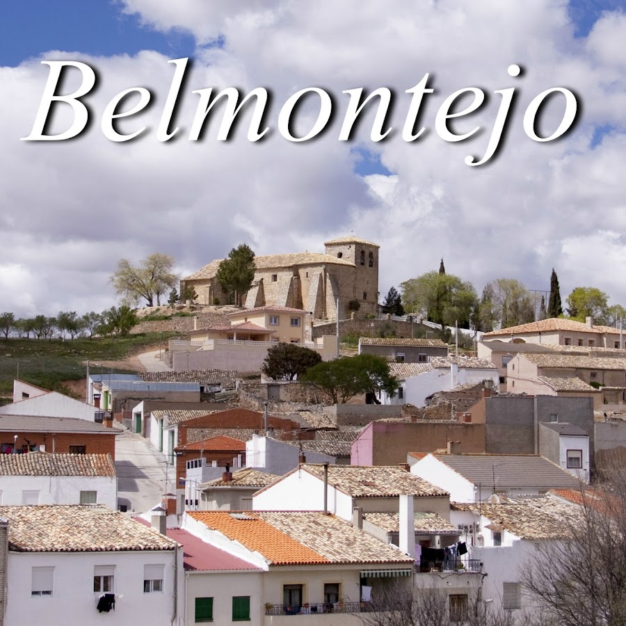
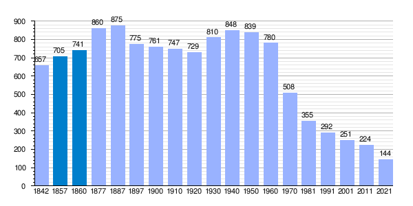

<!DOCTYPE html>
<html lang="en">
<head>
    <meta charset="UTF-8">
    <meta http-equiv="X-UA-Compatible" content="IE=edge">
    <meta name="viewport" content="width=device-width, initial-scale=1.0">
    <title>Belmontejo</title>
</head>
<body>
    <header>
            <h1>Castilla la Mancha</h1>
            <nav>
                <a href="index.html">Inicio</a>
                <a href="index2.html">Mapa</a>
            </nav>
    </header>
    
    

        <h2>El pueblo más bonito: Belmontejo</h2>
        

            Belmontejo es un municipio y localidad española de la provincia de Cuenca, en la comunidad autónoma de Castilla-La Mancha.
            El término municipal tiene una población de 135 habitantes.
            Integrado en la comarca de La Mancha Conquense, se sitúa a 45 km de la capital provincial. El término municipal está atravesado por la carretera N-420 entre los pK 388 y 393.

            El relieve del municipio se caracteriza por presentar muchas ondulaciones del terreno, además de contar con la presencia del río Marimota que desemboca en el embalse de Alarcón, que hace de límite con Albaladejo del Cuende.
            La altitud oscila entre los 968 m al norte y los 820 m a orillas del embalse. Al sur, destaca el cerro Cardenal, que alcanza los 966 m. 
            El pueblo se alza a 878 m sobre el nivel del mar. 
        

        
    

    

        <h2>Canción de Castilla la Mancha</h2>
        <audio src="Media/Audio.mp3" controls autoplay loop>Canción de Castilla la Mancha</audio>
    

    

        <h2>Demografía</h2>
        

            Este gráfico muestra los habitantes de Belmontejo desde 1842 a 2021
            Se ve un claro descenso de la población rural no solo en Belmontejo 
            si no en todos los pueblos de alrededor debido al éxodo rural del 
            campo a la ciudad
        

        
    

    

        <h2>Belmontejo en las noticias</h2>
        <iframe width="560" height="315" src="https://www.youtube.com/embed/a3HNBcmf4w0?si=_wPity1oNZqoO5ip" title="YouTube video player" frameborder="0" allow="accelerometer; autoplay; clipboard-write; encrypted-media; gyroscope; picture-in-picture; web-share" allowfullscreen></iframe>
    

    <a href="https://es.wikipedia.org/wiki/Belmontejo">Para más información pincha en este link</a>
    
Tiempo restante: 60 segundos

        

          

            
1. ¿En qué distrito se encuentra el barrio de Aluche en Madrid?

            <input type="text" id="answer1">
          

          

            
2. ¿Qué río atraviesa el barrio de Aluche?

            <input type="text" id="answer2">
          

          

            
3. ¿Cuál es el nombre del parque más grande de Aluche?

            <input type="text" id="answer3">
          

          

            
4. ¿Qué estación de trenes y metro es una de las principales de Aluche?

            <input type="text" id="answer4">
          

          

            
5. ¿Cómo se llama el centro comercial que hay en Aluche?

            <input type="text" id="answer5">
          

        

        <button onclick="submitAnswers()">Enviar respuestas</button>
        

      
      
</body>
</html>
